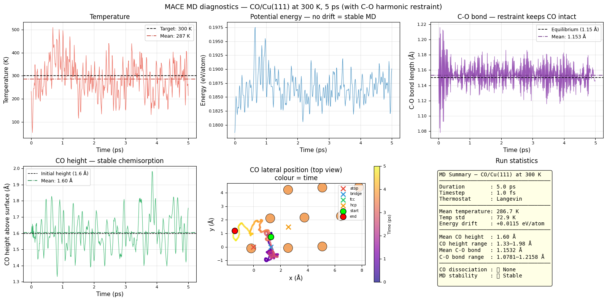

<p align="center">
  
</p>

<p align="center">
  <a href="https://colab.research.google.com/github/mminotaki/mace-surface-science-tutorials/blob/main/01_MACE_Surfaces_CO_Cu111.ipynb" target="_blank" rel="noopener noreferrer">
    
  </a>
  <a href="https://colab.research.google.com/github/mminotaki/mace-surface-science-tutorials/blob/main/02_MACE_ActiveLearning_CO_Cu111.ipynb" target="_blank" rel="noopener noreferrer">
    
  </a>
  <a href="https://colab.research.google.com/github/mminotaki/mace-surface-science-tutorials/blob/main/03_MACE_Architecture_CO_Cu111.ipynb" target="_blank" rel="noopener noreferrer">
    
  </a>
  <a href="https://colab.research.google.com/github/mminotaki/mace-surface-science-tutorials/blob/main/04_MACE_Reactions_CO_Cu111.ipynb" target="_blank" rel="noopener noreferrer">
    
  </a>
</p>

<p align="center">
  <a href="https://github.com/mminotaki/mace-surface-tutorials" target="_blank" rel="noopener noreferrer">
    
  </a>
  <a href="https://github.com/ACEsuit/mace" target="_blank" rel="noopener noreferrer">
    
  </a>
  <a href="https://opensource.org/licenses/MIT" target="_blank" rel="noopener noreferrer">
    
  </a>
  <a href="https://www.python.org" target="_blank" rel="noopener noreferrer">
    
  </a>
</p>

---

## 📖 Overview

**MACE Surface Science Tutorials** is a hands-on tutorial series for using [MACE](https://github.com/ACEsuit/mace) in surface science and heterogeneous catalysis. The series uses **CO adsorption on Cu(111)** as a running example, a well-characterised benchmark system,  and covers the complete workflow from training a model from scratch to computing reaction barriers.

All notebooks run on **Google Colab** (CPU or T4 GPU). 

> **Target audience:** PhD students and researchers in computational chemistry who want to use MLIPs in their research but are new to MACE.

> **Note:** These tutorials use EMT (Effective Medium Theory) as a fast reference method to keep runtimes short. 
---

## 🚀 Tutorials

| # | Notebook | Topic | Key concepts |
|---|----------|-------|-------------|
| 01 | [MACE for Surfaces](01_MACE_Surfaces_CO_Cu111.ipynb) | Training from scratch | Dataset generation, hyperparameters, MD |
| 02 | [Active Learning](02_MACE_ActiveLearning_CO_Cu111.ipynb) | Fixing a bad model | Iterative training, committee models, MACE-MP |
| 03 | [Inside MACE](03_MACE_Architecture_CO_Cu111.ipynb) | Architecture deep dive | Spherical harmonics, tensor products, message passing |
| 04 | [Reactions](04_MACE_Reactions_CO_Cu111.ipynb) | Transition states | MEP scan, NEB, Arrhenius kinetics |

---

## 🔬 What You Will Learn

- 🏗️ **Tutorial 01 — Training from scratch:** Build a CO/Cu(111) slab, generate a training dataset with EMT, configure and train MACE, evaluate model accuracy and run surface molecular dynamics.

- 🔄 **Tutorial 02 — Active learning:** Identify and fix a biased model, use iterative training to add failure configurations, build a committee of models to estimate uncertainty, and use MACE-MP for zero-shot prediction.

- ⚙️ **Tutorial 03 — Inside MACE:** Understand spherical harmonics and tensor products, trace the full forward pass (embedding → interaction → product → readout), and compute per-atom energies and forces via autograd.

- ⚗️ **Tutorial 04 — Reactions:** Scan the minimum energy path for CO diffusion, run a nudged elastic band (NEB) calculation with MACE forces, extract the activation barrier and compute diffusion rates via Arrhenius.

---

## ⚙️ Requirements

All notebooks install their own dependencies automatically in Colab:

```bash
pip install mace-torch ase
```

**Recommended runtime:** T4 GPU (Runtime → Change runtime type → T4 GPU).

**Google Drive:** Notebooks save models and trajectories to your Google Drive under `MyDrive/MACE_Surface_Tutorials/`. Files persist across Colab sessions.

---

## 🔭 Scientific Background

The system used throughout is **CO adsorption on Cu(111)**:

```
Experimentally:  CO prefers the atop site on Cu(111)
EMT/DFT-PBE:    incorrectly predicts fcc hollow as preferred site
                 (known GGA failure — see Hammer et al. 1999)
```

This system was chosen intentionally as a known benchmark rather than new science — allowing us to focus on the MACE methodology. MACE faithfully reproduces the reference method, including its errors. For quantitative predictions, replace EMT with DFT-level reference data.

---

## 🤝 Contributing

Feedback, bug reports and suggestions are welcome.
If you find issues or want to improve the tutorials:

---

## ⚖️ License

**MACE Surface Science Tutorials** is licensed under the [MIT License](LICENSE) — see the [LICENSE](LICENSE) file for details.

---

## 📚 References

- Batatia et al. *MACE: Higher Order Equivariant Message Passing Neural Networks for Fast and Accurate Force Fields.* NeurIPS 2022. [arXiv:2206.07697](https://arxiv.org/abs/2206.07697)

- Batatia et al. *A foundation model for atomistic materials chemistry.* 2024. [arXiv:2401.00096](https://arxiv.org/abs/2401.00096)

- Geiger & Smidt. *e3nn: Euclidean Neural Networks.* 2022. [arXiv:2207.09453](https://arxiv.org/abs/2207.09453)

- Henkelman et al. *A climbing image nudged elastic band method for finding saddle points and minimum energy paths.* J. Chem. Phys. 113, 9901 (2000). [DOI: 10.1063/1.1329672](https://doi.org/10.1063/1.1329672)

- Hammer et al. *Improved adsorption energetics within density-functional theory using revised Perdew-Burke-Ernzerhof functionals.* Phys. Rev. B 59, 7413 (1999). [DOI: 10.1103/PhysRevB.59.7413](https://doi.org/10.1103/PhysRevB.59.7413)
